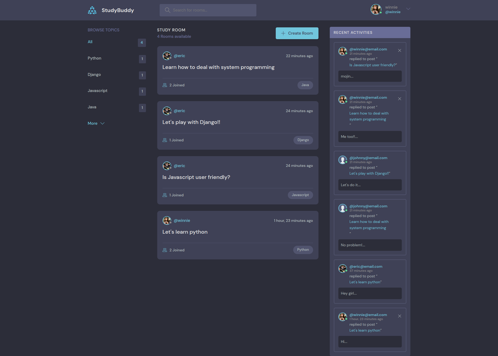
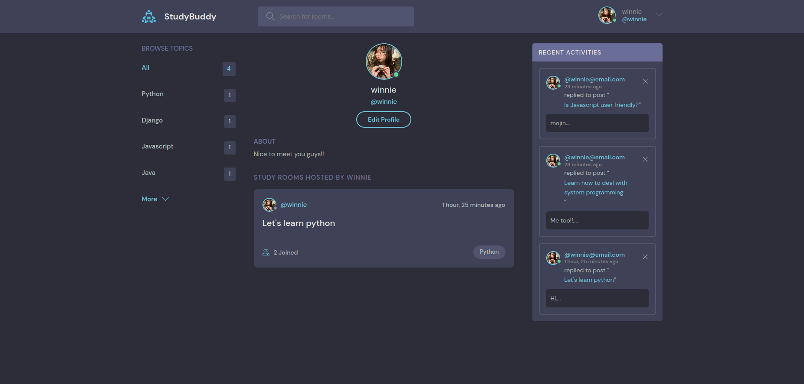
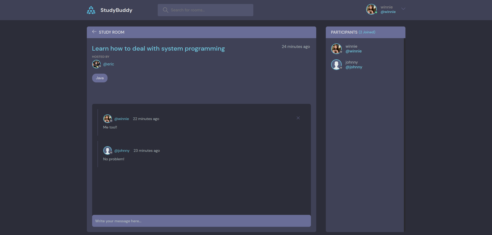
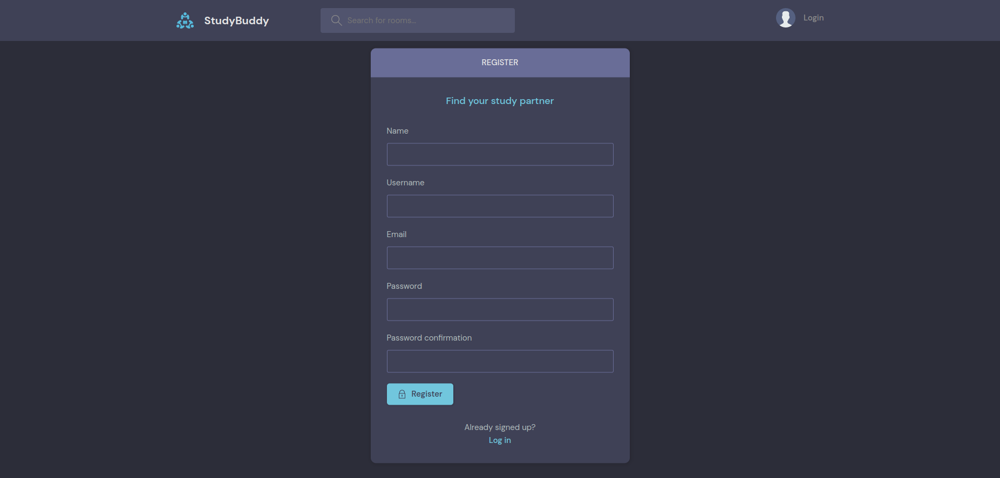

# StudyBuddy

## Features

+ User
1. Create user
2. Browse user profile
3. Update user
4. Delete user

+ Room
1. Create room
2. Browse rooms
3. Update room
4. Delete room

+ Message
1. Create message
2. Browse messages
3. Update message
4. Delete message

+ Browse recent activities

## App Preview
+ Home page

+ Profile page

+ Room page

+ Register page
